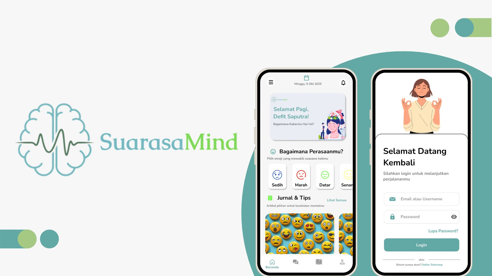
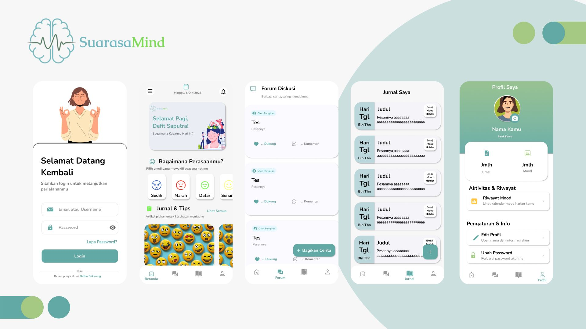
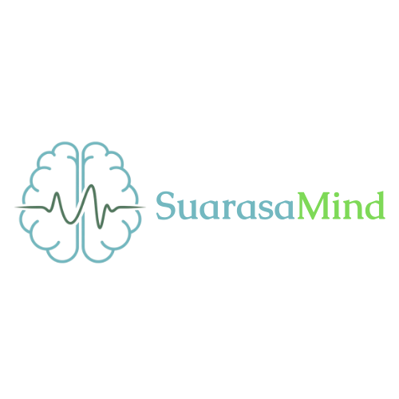

# SuarasaMind App

SuarasaMind adalah aplikasi mobile yang dirancang sebagai teman digital untuk membantu pengguna memahami, melacak, dan mengelola kesehatan mental mereka. Dengan antarmuka yang bersih dan menenangkan, aplikasi ini menyediakan ruang aman bagi pengguna untuk merefleksikan perasaan dan terhubung dengan komunitas yang suportif.

## LATAR BELAKANG

Di tengah meningkatnya tekanan dan kesibukan dalam kehidupan modern, kesadaran akan pentingnya kesehatan mental semakin tinggi. Banyak orang mencari cara yang mudah diakses dan privat untuk memahami emosi mereka. Namun, seringkali ada stigma atau keengganan untuk membicarakannya secara terbuka. SuarasaMind hadir sebagai solusi digital untuk menjembatani kesenjangan ini, menawarkan alat praktis untuk refleksi diri dan dukungan emosional langsung dari genggaman tangan.

## TUJUAN

Tujuan utama dari aplikasi SuarasaMind adalah:
1.  *Meningkatkan Kesadaran Diri:* Membantu pengguna mengenali dan mencatat suasana hati mereka secara teratur untuk memahami pola emosional mereka.
2.  *Menyediakan Ruang Ekspresi yang Aman:* Memberikan platform privat bagi pengguna untuk menulis jurnal tentang pikiran dan pengalaman mereka tanpa rasa takut dihakimi.
3.  *Membangun Komunitas Suportif:* Menciptakan forum diskusi di mana pengguna dapat berbagi cerita secara anonim dan saling memberikan dukungan.
4.  *Memberikan Wawasan:* Menampilkan riwayat suasana hati dalam format kalender yang mudah dipahami, sehingga pengguna dapat melihat perjalanan kesehatan mental mereka dari waktu ke waktu.

## FILOSOFI LOGO DAN NAMA

*SuarasaMind* adalah gabungan dari tiga kata:
* *Suara:* Representasi dari ekspresi, kemampuan untuk menyuarakan apa yang ada di dalam.
* *Rasa:* Merujuk pada perasaan, emosi, dan suasana hati.
* *Mind:* Merujuk pada pikiran dan kesadaran.

Secara filosofis, *SuarasaMind* berarti "Memberi Suara pada Perasaan Pikiran". Nama ini mencerminkan misi aplikasi untuk membantu pengguna mengekspresikan dan memahami kondisi batin mereka.

Logo aplikasi menggabungkan *simbol otak* dengan *gelombang suara/nadi*. Otak melambangkan pikiran (Mind), sementara gelombang melambangkan perasaan (Rasa) yang dinamis dan hidup. Kombinasi keduanya merepresentasikan keharmonisan antara kesehatan pikiran dan stabilitas emosional.

## FITUR UTAMA

Aplikasi SuarasaMind dilengkapi dengan beberapa fitur inti untuk mendukung perjalanan kesehatan mental pengguna:

1.  *Pelacak Suasana Hati (Mood Tracker)*
    * Pengguna dapat memilih emoji yang paling mewakili perasaan mereka setiap hari langsung dari halaman beranda.

2.  *Jurnal Pribadi*
    * Fitur untuk menulis catatan harian atau jurnal reflektif. Setiap entri jurnal dapat dihubungkan dengan suasana hati tertentu.

3.  *Forum Diskusi*
    * Sebuah ruang komunitas yang aman bagi pengguna untuk berbagi cerita, bertanya, dan memberikan dukungan kepada sesama pengguna.

4.  *Riwayat & Analitik Mood*
    * Menampilkan rekam jejak suasana hati dalam tampilan kalender, membantu pengguna mengidentifikasi tren dan pemicu emosional mereka.

5.  *Manajemen Profil*
    * Pengguna dapat melihat ringkasan aktivitas mereka (jumlah jurnal, mood tercatat) serta mengelola informasi akun dan pengaturan privasi.

6.  *Sistem Autentikasi*
    * Sistem login dan registrasi yang aman untuk memastikan privasi dan keamanan data jurnal pengguna.
